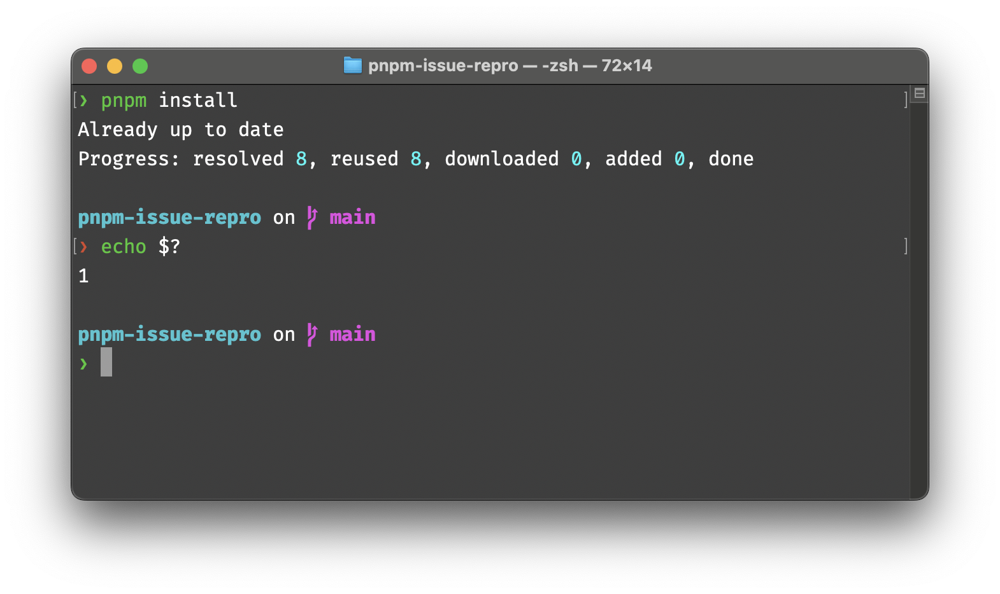

## Context
This is an example repo to demonstrate an issue with peer dependency error reporting in pnpm v9.

The repo is setup with:
- `strict-peer-dependencies` enabled
- A peerdeps issue - `react 18.2.0` and `react-dom 16.9.0` are installed
- `peerDependencyRules` allowing the above peer dependency

The pnpm version used is 9.14.2.

## Issue
Running `pnpm install` results in the following:

